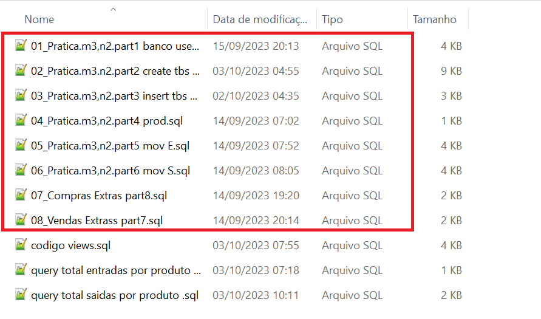
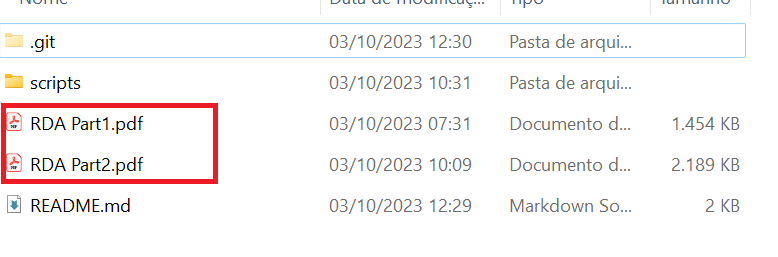

## Estacio| Missão Prática | Nível 2 | Mundo 3

## Descrição

Modelagem e implementação de um banco de dados simples,utilizando como base o SQL Server.
     

### Objetivos da prática

  - Identificar os requisitos de um sistema e transformá-los no
    modelo adequado.
  - Utilizar ferramentas de modelagem para bases de dados
    relacionais.
  - Explorar a sintaxe SQL na criação das estruturas do banco
    (DDL).
  - Explorar a sintaxe SQL na consulta e manipulação de dados
    (DML)
  - No final do exercício, o aluno terá vivenciado a experiência
    de modelar a base de dados para um sistema simples, além
    de implementá-la, através da sintaxe SQL, na plataforma do
    SQL Server.

### Procedimentos

- Os procedimentos são divididos em duas etapas

  - 1º Procedimento | Criando o Banco de Dados
    -   Efetuar a modelagem do banco 
    -   Baixar e instalar o sql server express  
    -   Utilizar o SQL Server Management Studio na criação da entidades
    -   Geração de scripts pertinentes ao desenvolvimento acima
    -   Gerar Relatório discente de acompanhamento (RDA Part1.pdf) 
      
   
 -  2º Procedimento | Criação do Cadastro em Modo Texto    
    -    Utilizar o SQL Server Management Studio para popular as
         tabelas com dados básicos do sistema 
    -    Apresentar dados cadastrados
    -   Geração de scripts pertinentes ao desenvolvimento acima
    -   Gerar Relatório discente de acompanhamento (RDA Part2.pdf)
    
  - Execução e verificação dos resultados
    - Os scripts devem ser gerados na ordem descrita onde estarão realizando a criação do banco,usuario, assim como a carga com dados fictcios (mock data)
    - os scripts serão encontrados na pasta "scripts" e estão descritos na sequencia que devem ser executados
       - Criação do banco loja e usuario loja
          - 01_Pratica.m3,n2.part1 banco user.sql
       - Criação de todas as tabelas
          - 02_Pratica.m3.n2.part2 create tbs views.sql
       - Criando usuarios pessao fisica e juridica
          - 03_Pratica.m3,n2.part3 insert tbs pessoas usuario.sql
       - Criando Produtos
          - 04_Pratica.m3,n2.part4 prod.sql
       - Criando movimentos de entrada 
          - 05_Pratica.m3,n2.part5 mov E.sql
       - Criando movimentos de saida
          - 06_Pratica.m3,n2.part6 mov S.sql
      - Inserindo vendas extras 
          - 07_Compras Extras part8.sql
      - Inserindo compras extras
          - 08_Vendas Extrass part7.sql

     

    obs1: apenas o primero script deve ser utilizado com sa, os seguintes é necessário que se esteja logado com usuario "loja"

 - Os relatórios podem ser encontrados na pasta raiz

    

     
     ## Especificação
       https://sway.office.com/LgKHUsnFtAiNx48i?ref=Link&loc=play
    
   
